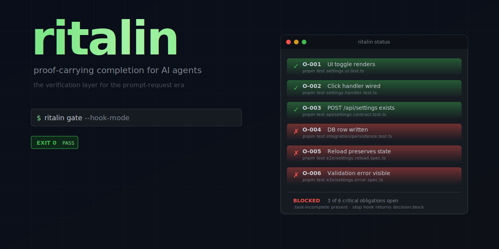

<div align="center">



# ritalin

**Proof-carrying completion for AI coding agents. Block "I'm done" until every critical obligation has evidence.**

<br />

[](https://github.com/199-biotechnologies/ritalin/stargazers)
&nbsp;&nbsp;
[](https://x.com/longevityboris)

<br />

[](LICENSE)
&nbsp;
[](https://www.rust-lang.org)
&nbsp;
[](CONTRIBUTING.md)
&nbsp;
[](https://crates.io/crates/ritalin)

---

The verification layer for the prompt-request era. Turn vague intent into a tracked contract, then block stop until every critical obligation has passing evidence.

[Install](#install) · [How it works](#how-it-works) · [Hook into Claude Code](#hook-into-claude-code) · [Why this exists](#why-this-exists) · [Architecture](#architecture)

</div>

## Why this exists

> "Peter Steinberger told me that he wants PR to be 'prompt request'. His agents are perfectly capable of implementing most ideas, so there is no need to take your idea, expand it into a vibe coded mess using free tier ChatGPT and send that as a PR, which is now most PRs."
>
> — Andrej Karpathy ([@karpathy](https://x.com/karpathy/status/2040473058834878662)), April 2026

In the prompt-request era, code is no longer the artifact. Intent is. But there's a gap nobody has filled: **how do you trust the proof?** Even Karpathy admits it:

> "The agents do not listen to my instructions in the AGENTS.md files... I think in principle I could use hooks or slash commands to clean this up but at some point just a shrug is easier."
>
> — Andrej Karpathy ([@karpathy](https://x.com/karpathy/status/2035173492447224237)), March 2026

ritalin is the hooks. So you don't have to shrug.

## The problem

Coding agents stop at 80%. They claim "done" when the wiring is half-finished. They forget the scope. As context fills, they agree with their own past mistakes to stay consistent. The list they hand back is shorter than the one they started with.

This is not a motivation problem. It is a **contract failure under information asymmetry**. The agent knows what it did. You can only see what it says. RLHF rewards reports that sound complete. So the model converges on confident incompletion.

ritalin closes the gap mechanically. Not with a sterner prompt. With an append-only ledger and a stop hook that refuses to lie.

## Before vs after

| Without ritalin | With ritalin |
|---|---|
| "I've added the notification toggle" | `BLOCKED: Obligation O-004 (DB row written) lacks passing evidence. Run: pnpm test integration/persistence.test.ts` |
| You re-open the task three times | The agent re-opens it three times — silently, until evidence exists |
| `git diff` looks plausible | `.task-incomplete` exists until proof exists |
| Tests pass, the feature half-works | Every critical obligation has a verified exit code 0 in `EVIDENCE.jsonl` |
| You read the code to verify | You read the proof bundle |

## Install

```bash
# macOS / Linux via Homebrew
brew tap 199-biotechnologies/tap
brew install ritalin

# Or via Cargo
cargo install ritalin

# Or download the binary directly
curl -L https://github.com/199-biotechnologies/ritalin/releases/latest/download/ritalin-aarch64-apple-darwin.tar.gz | tar -xz
```

Then install the agent skill so Claude Code, Codex, and Gemini all know how to use it:

```bash
ritalin skill install
```

## How it works

```
1. ritalin init --outcome "User can save and reload notification preferences"
2. ritalin add "UI toggle renders"        --proof "pnpm test settings.ui.test.ts"        --kind user_path
   ritalin add "POST /api/settings exists" --proof "pnpm test api/settings.contract.ts"  --kind integration
   ritalin add "DB row persists"           --proof "pnpm test integration/db.test.ts"    --kind persistence
   ritalin add "Reload preserves state"    --proof "pnpm test e2e/reload.spec.ts"        --kind user_path
   ritalin add "Validation error visible"  --proof "pnpm test e2e/error.spec.ts"         --kind failure_path
3. Wire ritalin gate --hook-mode into Claude Code's Stop event (one-time setup)
4. The agent works. It runs `ritalin prove O-001`, `ritalin prove O-002`, ... as it discharges obligations
5. The agent tries to stop. Stop hook fires. Gate reads obligations + evidence
6. If any critical obligation lacks passing evidence: gate blocks with the exact failing claim and command
7. Agent fixes it. Re-runs prove. Tries to stop again. Loop until all proofs pass
8. Gate removes .task-incomplete. Stop allowed. Done. Actually done. With evidence on disk.
```

## Hook into Claude Code

Add to `.claude/settings.json` (project) or `~/.claude/settings.json` (global):

```json
{
  "hooks": {
    "Stop": [
      {
        "hooks": [
          {
            "type": "command",
            "command": "ritalin gate --hook-mode"
          }
        ]
      }
    ]
  }
}
```

The gate reads `stop_hook_active` from stdin to break out of forced-continuation cycles. No infinite loops. No babysitting.

## Features

| | What it does |
|---|---|
| **Append-only ledgers** | `obligations.jsonl` and `evidence.jsonl` are line-atomic on POSIX. Never corrupted, never silently rewritten. |
| **Critical / advisory** | Block on critical, warn on advisory. Risk-routed enforcement. |
| **Default incomplete** | `.task-incomplete` exists until the gate removes it. The agent must prove completion, not claim it. |
| **Hook-mode + CLI mode** | One binary, two output shapes. Use it from Claude Code's Stop hook OR from your terminal. |
| **`stop_hook_active` aware** | Reads stdin to detect forced-continuation cycles. Never loops infinitely. |
| **Semantic exit codes (0–4)** | Agents can branch on `2 = config`, `3 = bad input`, `1 = transient`. Standard contract from [agent-cli-framework](https://github.com/199-biotechnologies/agent-cli-framework). |
| **JSON envelope on pipes** | Auto-detects piping. Coloured tables in your terminal, structured JSON to your scripts. |
| **`agent-info` discovery** | One command returns the full capability manifest. Agents bootstrap without external docs. |
| **Embedded SKILL.md** | `ritalin skill install` deploys to `~/.claude/skills`, `~/.codex/skills`, `~/.gemini/skills` in one command. |
| **Self-update** | `ritalin update --check` against GitHub Releases. |

## Architecture

```
.ritalin/
├── scope.yaml          # human-edited contract: outcome + metadata
├── obligations.jsonl   # append-only obligation ledger
└── evidence.jsonl      # append-only proof records (command, exit code, output tail)
.task-incomplete        # marker file at repo root; presence = "agent must keep working"
```

Three properties make this work:

1. **Append-only ledgers** — the agent can add obligations or record evidence, but cannot rewrite history. Tampering is visible.
2. **Default incomplete** — `.task-incomplete` is created by `init` and removed only by `gate` when every critical obligation has evidence. The agent has to actively prove its way to a clean stop.
3. **External state** — the contract survives compaction, `/clear`, context resets, and crashes. The session doesn't have to remember anything.

## Differentiation

| Tool | What it does | What ritalin adds |
|---|---|---|
| [Ralph Wiggum](https://github.com/anthropics/claude-code/blob/main/plugins/ralph-wiggum/README.md) | Loop until done | **Contracted** persistence — loop only against verifiable criteria |
| [Superpowers](https://github.com/obra/superpowers) | Workflow guidance via skills | Runtime law — changes what the agent is allowed to claim |
| [Hookify](https://github.com/anthropics/claude-code/tree/main/plugins/hookify) | Generic hook creation | Specialised anti-premature-completion harness with scope contracts and evidence ledgers |
| [GitHub Spec Kit](https://github.com/github/spec-kit) | Spec-driven workflow structure | Runtime enforcement of the "validate" phase |
| [whenwords](https://github.com/dbreunig/whenwords) | Spec-only library, no code | The runtime that runs the YAML proofs at the right moment |

## Built on

ritalin is built on the [agent-cli-framework](https://github.com/199-biotechnologies/agent-cli-framework), the canonical Rust pattern set for CLIs that AI agents can discover and use autonomously. Single binary. <10ms cold start. JSON envelope. Semantic exit codes. Embedded skill files.

## Contributing

This is v0.1. The roadmap is open. The biggest open questions:

- **Diff compiler** — `ritalin compile` infers obligations from `git diff` + a `patterns.yaml` library. The TDAD approach: provide local verification context, not generic process advice.
- **Cadence governor** — `ritalin orient` as a periodic re-anchor checkpoint, the body-doubling mechanism for long sessions.
- **Pattern learning** — `ritalin learn` updates `patterns.yaml` from reopen history, so the system gets better at predicting which obligations matter for your repo.
- **Multi-modal verification** — pixel-diff proof for UI claims via headless browser.

PRs welcome. Open an issue first if you're touching the gate logic — it's load-bearing.

## License

MIT — see [LICENSE](LICENSE).

---

<div align="center">

Built by [Boris Djordjevic](https://github.com/longevityboris) at [Paperfoot AI](https://paperfoot.com)

<br />

**If this is useful to you:**

[](https://github.com/199-biotechnologies/ritalin/stargazers)
&nbsp;&nbsp;
[](https://x.com/longevityboris)

</div>
